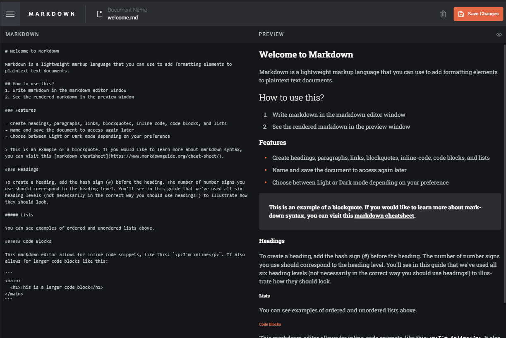
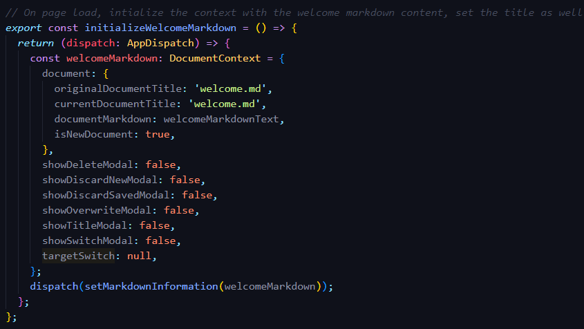
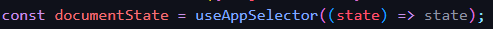
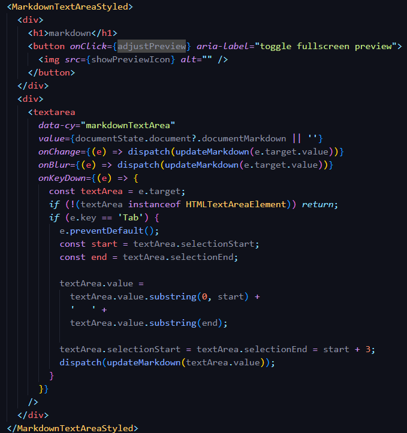
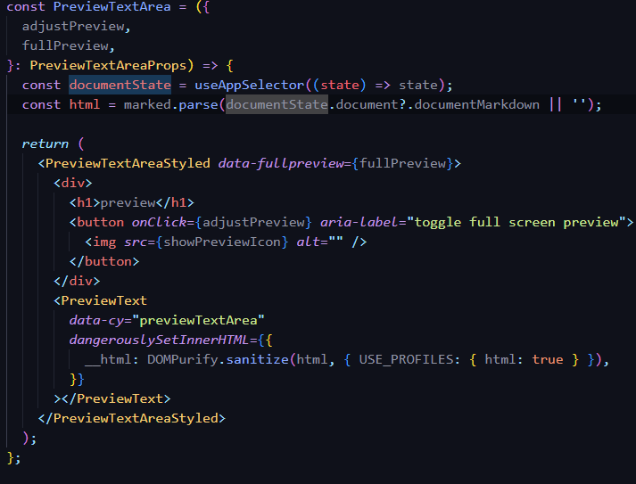

# In-Browser Markdown Editor Web-Application

Project provided by [FrontEndMentors](https://www.frontendmentor.io/challenges/inbrowser-markdown-editor-r16TrrQX9). Design and main requirements provided thanks to FrontEndMentor.

The requirement of the project is to create a markdown editor web-application that is capable of the following:

- Create markdown and see a preview of the markdown rendered updated in real-time
- Save created markdown documents
- Switch between saved markdown documents
- Modify saved documents and delete documents as well

## Techstack Used

Project was bootstrapped with [Vite](https://vitejs.dev/guide/) using the the React/Typescript template. [Eslint](https://eslint.org/) lint used with react, prettier, and cypress rules.

- [React](https://reactjs.org/docs/getting-started.html) (Front end framework/library)
- [Cypress](https://docs.cypress.io/guides/overview/why-cypress) (End-to-end testing)
- [Styled Components](https://styled-components.com/) (Style the application)
- [Redux](https://redux.js.org/) and [Redux toolkit](https://redux-toolkit.js.org/) (State management)

The [Local Storage Browser API](https://developer.mozilla.org/en-US/docs/Web/API/Window/localStorage) is being used to save markdown documents to the user's browser. User's can access this storage to then switch over to different documents they have saved.

## Development

### Markdown Render

The first thing I wanted to get done was converting/parsing string and rendering it into markdown on the page. It would take an extenstive amount of time to create my own implementation, so it was decided upon early to find a package on NPM to handle this part of the application.

After researching, I came upon the [marked](https://www.npmjs.com/package/marked), it is a low-level compiler for parsing markdown without caching or blocking for long periods of time. It simply takes in some string, and any markdown syntax is returned back as HTML string.
One issue with the package is that it does not sanitize the output HTML, meaning that attackes can inject pontentially harmful code into the application. So solve this, I instaleld the [DOMPurify](https://www.npmjs.com/package/dompurify) package which sanitizes HTML string. The idea is that marked will create the HTML string, then that HTML string is passed into DOMPurify.

#### Redux

Each markdown document was set to include the following information:

1. The markdown content
2. The document name
3. Was the document new or not?
4. The title of the document when it was loaded/created, since the user is allowed to change the name of the document, we have to keep track of the last known document name so we can know which document to remove/replace with the newly changed name. This was mainly used for saving to local storage.

When I initally planned the application and got the markdown render working, I came to the realization that I was creating many instances of state, and more importantly, was passing this state as props down through multiple components (prop-drilling). Some examples of this include

- The left side-bar having to take in documents to display and switch over to another document.
- The top-bar needing document information to save documents and delete documents

Too much information was being passed down to each of these components, making it harder to understand what was going on and to read the application code.

After a bit of research, I came to the conclusion that a state management tool will be needed for this application. At the time I had experience in Redux, along with the Redux toolkit, so I decided to choose redux as my state management tool.

This change caused me to view what instances of state should just exist in every component, eventually I came to this final solution: the store will hold information about the current document that is on the page, so the current document content, title, and last known name will be in the redux store. The redux store will only know about the current document on the page, with the ability for it read from local storage and load other documents.

Another aspect of the application was to make it clear to the user when a major change to the application is about to occur, something went wrong, or a conflict in regards to a save conflict occured.

A redux store was created to handle the following:

- **Load a document**, a reducer can take in a document object and use it set the store to this document's information, and displaying it on the page
- **Update the markdown content**, when a user types into the markdown text area, the store's content is updated.
- **change the document title**, reducer to change the title in the redux store (local storage change done somewhere else)
- **remove a document/set store to null**, a user can delete a document and potentially be left with no document to view, thus the store should have a "null" state to indicate there is no document on the page to edit.
- **Hide/show a message to the user**, multiple boolena values were created that, if active, will display a certian modal, giving them the option to cancel/confirm the action. Both the show metod ensures that every modal display boolean value is set to false, except the one that is passed into the payload. The hide reducer will set the payload's target to false, hiding the modal.

Instead of calling reducer methods directly, I instead created mulitple dispatch functions that will call the store's dispatch itself.

In the example above, the `initalizeWelcomeMarkdown` function takes in a dispatch function, which create a document to be rendered on the page load, and passes it into the redux store dispatch, chaning the state of the store.

With this, each component that needs to access the document state can extract it with the `useAppSelector` hook which returns the typed redux store state. See the example below.

#### Markdown Text Component

This component is where a user will input text into a textbox to become rendered markdown on the preview pane. Each change/blur event fires off the dispatch function to update the redux store document content value with the current value of the textbox. One issue with using ``<textarea>`` was that clicking ``tab`` key would do two things. 
1. Focus on the next element on the page.
2. Not insert a "tab" (four spaces) onto the markdown. 

The solution to this was to create a ``onKeyDown`` event where if the "tab" key was clicked, we stop it from moving to the next element, grab the currnet position of the cursor, add four spaces to that position, and move the cursor to the point after the four spaces. I also ensured that we fired the dispatch function so the store will be updated with this change as well. 

The main issue with this implemenation was that you cannot "undo" this change. If one manually types in four spaces they can undo those changes, but the tab implementation here does not work. I will continue to research ways to fix this, or find a new implemenation that does not have this issue.

#### Preview Text Component

The purpose of the PreviewText component is to read the document string from the redux store and render it as Markdown.

The document string is placed in a redux store, so the component extractes the document state from the Redux store, and a "html" variable is created on each render which will parse the document string, if it does not exist, or is empty, an empty string will be rendered.

In the JSX, I dangerously set the HTML so that the markdown can be rendered, however, since the html string has been sanitized this is safe. 

#### Saving a Document

Please see the file ``TopBar.tsx`` to see the save implementation. The code would be too long to post here. This is a part of the application that I really want to come back to and refactor, the function saving a document is very large and I believe that are ways to cut this down to something more efficient and readble. Here is a general run-down on how the function works:
1. If there is no document on the page, then we ensure that the function no longer continues, a state is being applied be the use Effect in the component to disable the button if there is no document, so this is just a backup check. 
2. Grab the documents saved in local storage, this can potentially be null. 
3. Check for a valid document name, a valid document name should end with ".md" and contain no spaces, if this check fails then fire the dispatch function to display the "invalid title" modal to the user and return. 
4. If there are no saved documents, then create a new JSON object that uses the document title as a key, and creates a saved document with the current date. We immediately set the local storage item because we do not have to worry about over-writing anything becuase it is empty. We fire the dispatch function so that the "previousTitle" state in the store is updated to the title that was just saved. Finally we fire an event with the ``window`` object fires a storage event, allowing the newly stored item to be displayed on the left-bar.
5. If we have a document, and the document being saved is "new", then we check to see if the document title already exists, if it does then we display a modal that will ask the user if they wish to ovewrite the document or cancel the save. If there are no conflicts, then grab the local storage documenets and append a new object that contains the document's information to the object, which is then stringified and set as the new local storage data.
6. If this is not a new document, then we check to see if current title of the document is the same as the one saved into the local storage, if it is then just overwrite the local storage data and set the item. If the titles do not match, this means the user changed the document name, so then the the previous object with the old document title is removed from the local storage data, and an object with the new document title is inserted into the local storage. 

## What to Improve

The main thing would be the project structure, for example the long function that is used to save markdown should be refactored to become easiesr to read and efficient. This was my first time using Redux this extensively so I want research more efficient ways to set and extract from the redux store. 

